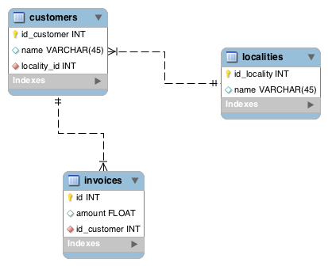

workbench_alchemy
=================

SQLAlchemy model creation for MySQL Workbench

If you want to use it as a design software and your DB is not mysql, you can disable the use of MySQL specific types by changing:

```
USE_MYSQL_TYPES = True
```

to

```
USE_MYSQL_TYPES = False
```

### How to execute example.mwb file?
- Open MYSQL Workbench;
- Find & Open `example.mwb`;
- In Menubar, choose `Scripting`->`Run Workbench Script File`(`⇧+⌘+R` in os x)
- Select `sqlalchemy_grt.py` and done.

### Want to see?

This:



On execution it should look like this:
```
Executing script /Users/xxx/Library/Application Support/MySQL/Workbench/scripts/sqlalchemy_grt.py...
--------------------
-- SQLAlchemy export v0.10.3
--------------------
 -> Working on customers
 -> Working on localities
 -> Working on invoices
Copied to clipboard

Script finished.

```

Then you just have to paste it somewhere, hopefully it looks like this:

```python
"""
This file has been automatically generated with workbench_alchemy v0.10.3
For more details please check here:
https://github.com/PiTiLeZarD/workbench_alchemy
"""

USE_MYSQL_TYPES = True
try:
    from . import USE_MYSQL_TYPES
except:
    pass


from sqlalchemy.orm import relationship
from sqlalchemy import Column, ForeignKey
from sqlalchemy.schema import UniqueConstraint
from sqlalchemy.ext.declarative import declarative_base

if USE_MYSQL_TYPES:
    from sqlalchemy.dialects.mysql import INTEGER, VARCHAR, FLOAT
else:
    from sqlalchemy import Integer as INTEGER, String as VARCHAR, Float as FLOAT

Base = declarative_base()


class Customer(Base):
    __tablename__ = 'customers'

    id = Column("id_customer", INTEGER, nullable=False, primary_key=True)
    name = Column(VARCHAR(45), index=True)
    id_locality = Column("locality_id", INTEGER, ForeignKey("localities.id_locality", ondelete="CASCADE"), nullable=False, index=True)

    locality = relationship("Locality", foreign_keys=[id_locality])

    def __repr__(self):
        return self.__str__()

    def __str__(self):
        return '<Customer %(id)s>' % self.__dict__


class Locality(Base):
    __tablename__ = 'localities'

    id = Column("id_locality", INTEGER, nullable=False, primary_key=True)
    name = Column(VARCHAR(45), unique=True)

    def __repr__(self):
        return self.__str__()

    def __str__(self):
        return '<Locality %(id)s>' % self.__dict__


class Invoice(Base):
    __tablename__ = 'invoices'

    id = Column(INTEGER, nullable=False, autoincrement=True, primary_key=True)
    total = Column("amount", FLOAT)
    id_customer = Column(INTEGER, ForeignKey("customers.id_customer"), nullable=False, index=True)

    test = relationship("Customer", foreign_keys=[id_customer], backref="testbackrefs")

    def __repr__(self):
        return self.__str__()

    def __str__(self):
        return '<Invoice %(total)s %(id)s>' % self.__dict__
```

### List of options

I started to add options here and there, it's probably a good idea to keep track of it!

Options are done in the comment part of fields/tables on the form:
```
optname=optvalue,optname=optvalue...
```

#### Option on the table

 * norelations will disable all relations for this table (should update that to relations=False)
 * abstract will create a tablename-less abstract class

#### Option on the fields

 * relation=False : disable relationship for this column
 * backref=False : disables backref for this relationship
 * backrefname=myName : rename the backref in the relationship
 * fkname=myName : rename the relationship itself
 * alias=myName : rename the column mapping name (DB keeps whatever the name in the schema is)
 * toprint=True : (or False) controls what's printed when using print str(myObject)
 * default works as ```default=%s``` which means you can put ```"THIS STUFF"``` as default but also ```datetime.datetime.utcnow, onupdate=datetime.datetime.utcnow```

## Structure of code

Or rather a suggestion, this is how I use it:
```
./mylib/db/schema.py <-- I will describe this file
./mylib/db/auto/__init__.py <- I just have USE_MYSQL_TYPES = True in there
./mylib/db/auto/schema.py <- I copy bluntly here the result of the script
```

So about the schema file in mylib/db/schema, here is a possibile implementation which works for me:
``` python

import sqlalchemy
from sqlalchemy.orm import sessionmaker, scoped_session

from mylib.db.auto.schema import *

Session = None

def connect(dburi=None, **kwargs):
    dburi = dburi or 'sqlite:///'
    createtable = False
    if 'createtable' in kwargs:
        createtable = kwargs.pop('createtable')

    engine_params = {'pool_size': 5, 'pool_recycle': 3600}
    if dburi.startswith('sqlite'):
        engine_params = {}

    engine = sqlalchemy.create_engine(dburi, **engine_params)
    connection = engine.connect()

    if dburi.startswith('sqlite'):
        connection.connection.connection.text_factory = str

    session = scoped_session(sessionmaker(**kwargs))
    session.configure(bind=engine)

    if createtable:
        Base.metadata.create_all(engine)
        if 'autocommit' not in kwargs:
            session.commit()

    return session

if __name__ == '__main__':
    Session = connect(createtable=True)
    Session.commit()
```

So this leaves you with the possibility of creating the database by just calling:
``` bash
$ python mylib/db/schema.py
```

You can also extend the classes easily in this schema file. Though, I don't use standard inheritence 
but more extensions of objects like this:

``` python
def myFunction(self, *args, **kwargs):
    self.myfield = kwargs.get('myfield', None)
Customer.myFunction = myFunction
```

### Using SQLite in your tests? No dramas:

Just add those lines at the top of your test files:

``` python
import mylib.db.auto
mylib.db.auto.USE_MYSQL_TYPES = False
```

and you're good to go
